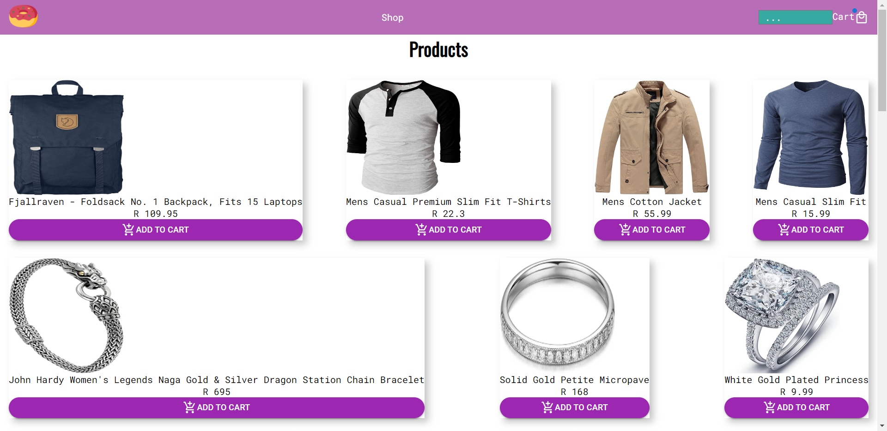
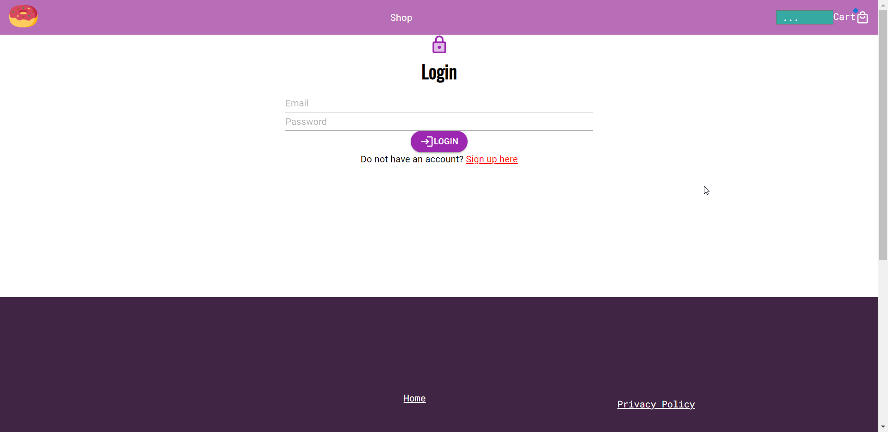
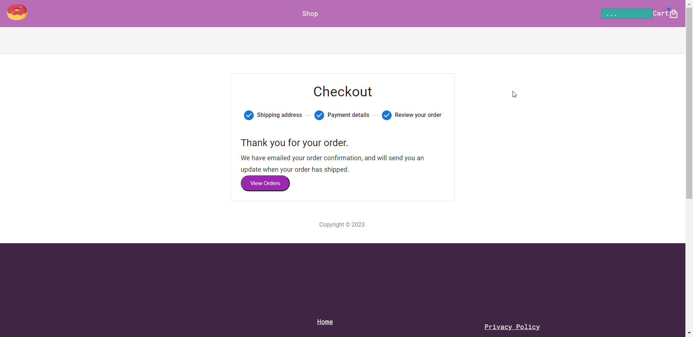
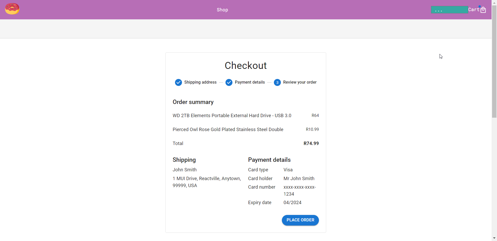
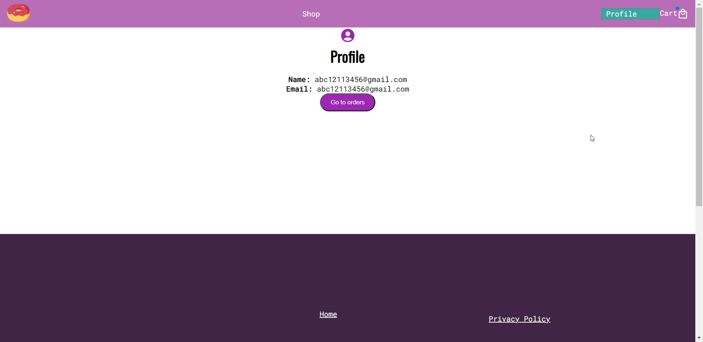
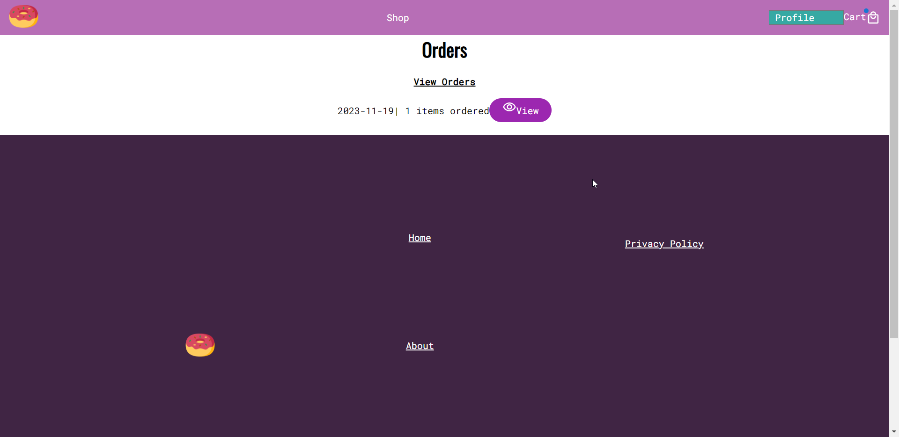
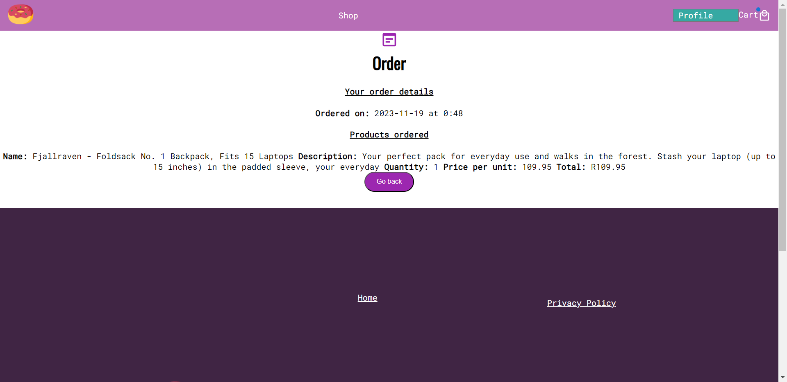

# E-Commerce Store

## Overview

This is an online e-commerce store where users can easily browse through products and make purchases online. The store is built using React for the frontend, Material-UI (MUI) for the user interface components, Node.js for the backend, MongoDB for the database, and Payfast for handling secure and convenient payments.

## Features

- **Product Browsing:** Users can explore a wide range of products with detailed information, including images, descriptions, and prices.

- **User-friendly Interface:** The frontend is developed using React and MUI, providing a smooth and responsive experience for users on various devices.

- **Secure Payments:** The payment system is integrated with Payfast, ensuring secure and reliable online transactions.

- **Database:** MongoDB is used as the database to store and manage product information and user data.

## Screenshots
##### Homepage

##### Login

##### Checkout

##### Review order

##### Profile page

##### Orders

##### Order


## Getting Started

### Prerequisites

- Make sure you have Node.js installed on your machine.
- You'll need a MongoDB instance. You can set up a local instance or use a cloud-based service like MongoDB Atlas.

### Installation

1. Clone the repository:

   ```bash
   git clone https://github.com/ntandoyenkosi1/e-commerce-store.git
   ```

2. Navigate to the project directory:

   ```bash
   cd e-commerce-store
   ```

3. Install dependencies for both frontend and backend:

   ```bash
   cd client
   npm install

   cd ../server
   npm install
   ```

### Database Setup

1. Configure MongoDB connection in the backend. Open the `.env` file in the backend directory and add your MongoDB connection string.

### Running the Application

1. Start the backend server:

   ```bash
   cd server
   npm start
   ```

2. In a separate terminal, start the frontend:

   ```bash
   cd client
   npm start
   ```

3. Open your browser and navigate to `http://localhost:3000` to see the e-commerce store in action.


## License

This project is licensed under the [MIT License]().

Happy Shopping! 🛒✨